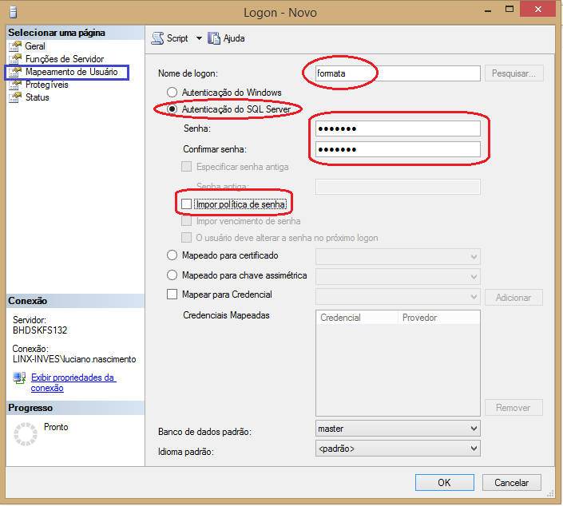

# Configuração de Logins no SQL Server

## Introdução

A configuração de logins no SQL Server é uma das tarefas essenciais para garantir que o acesso ao banco de dados seja controlado adequadamente. Existem dois tipos principais de logins no SQL Server: logins do SQL Server e logins do Windows. Neste post, vamos explorar como configurar ambos os tipos de logins e discutir práticas recomendadas para gerenciar o acesso de usuários.

## 1. Criando Logins no SQL Server

No SQL Server, você pode criar logins através do Management Studio ou via T-SQL. Vamos começar com um exemplo básico de como criar um login de SQL Server:

```sql
CREATE LOGIN NovoUsuario WITH PASSWORD = 'SenhaSegura123';
````

Este comando cria um login com o nome `NovoUsuario` e uma senha associada. Após a criação, você precisa conceder permissões para esse login. Isso é feito associando-o a uma conta de usuário dentro de um banco de dados específico.

### Exemplo de criação de login com configuração de senha expirada:

```sql
CREATE LOGIN NovoUsuario 
WITH PASSWORD = 'SenhaSegura123',
     CHECK_POLICY = ON, 
     CHECK_EXPIRATION = ON;
```

Neste exemplo, a política de senha e a expiração de senha são habilitadas, forçando o usuário a alterar a senha após o prazo determinado.

## 2. Criando Logins do Windows

Você também pode criar logins baseados no Windows, permitindo que os usuários acessem o banco de dados utilizando suas credenciais do sistema operacional:

```sql
CREATE LOGIN [DOMINIO\Usuario] FROM WINDOWS;
```

Neste caso, o login é criado utilizando a conta do Windows `DOMINIO\Usuario`.

### Logins do Windows vs SQL Server

* **Logins do SQL Server**: São úteis em cenários onde os usuários não fazem parte de um domínio ou quando você precisa de autenticação exclusiva no SQL Server.
* **Logins do Windows**: São recomendados quando a segurança do domínio e a administração de contas de usuários já estão sendo feitas no nível do sistema operacional.

## 3. Associando Logins aos Bancos de Dados

Depois de criar o login, o próximo passo é associá-lo a um banco de dados. Isso é feito criando um usuário no banco de dados para o login:

```sql
USE MeuBancoDeDados;
CREATE USER NovoUsuario FOR LOGIN NovoUsuario;
```

O comando acima cria um usuário no banco de dados `MeuBancoDeDados` associado ao login `NovoUsuario`.

### Exemplo de associação de login do Windows:

```sql
USE MeuBancoDeDados;
CREATE USER [DOMINIO\Usuario] FOR LOGIN [DOMINIO\Usuario];
```

## 4. Concedendo Permissões

Após associar o login ao banco de dados, você deve conceder as permissões necessárias. Por exemplo, para conceder permissões de leitura e gravação:

```sql
GRANT SELECT, INSERT, UPDATE, DELETE ON SCHEMA::dbo TO NovoUsuario;
```

Isso permite que o usuário `NovoUsuario` tenha permissões de leitura e escrita em todas as tabelas dentro do esquema `dbo`.

### Exemplo de concessão de permissões a logins de Windows:

```sql
GRANT EXECUTE ON SCHEMA::dbo TO [DOMINIO\Usuario];
```

Neste caso, o login do Windows `[DOMINIO\Usuario]` recebe permissão para executar stored procedures no esquema `dbo`.

## 5. Considerações de Segurança

* **Senhas fortes**: Sempre utilize senhas fortes para logins do SQL Server. Senhas fracas são um dos principais vetores de ataque.
* **Privilégios mínimos**: Evite usar logins com permissões administrativas, a menos que absolutamente necessário. Utilize o princípio do "menor privilégio".
* **Logins do Windows**: Sempre que possível, use logins do Windows, pois eles aproveitam a segurança e os controles de autenticação do sistema operacional.
* **Auditoria**: É importante configurar auditoria de segurança para monitorar atividades de logins, como tentativas de login falhas e logins com privilégios elevados.




## Conclusão

A configuração de logins no SQL Server é uma tarefa fundamental para garantir a segurança e o controle de acesso aos dados. Ao criar logins adequados e aplicar as melhores práticas de segurança, como senhas fortes e permissões mínimas, você estará protegendo seu ambiente de banco de dados contra acessos não autorizados. Além disso, é importante revisar regularmente as permissões e garantir que os logins sejam mantidos atualizados e em conformidade com as políticas de segurança da organização.


