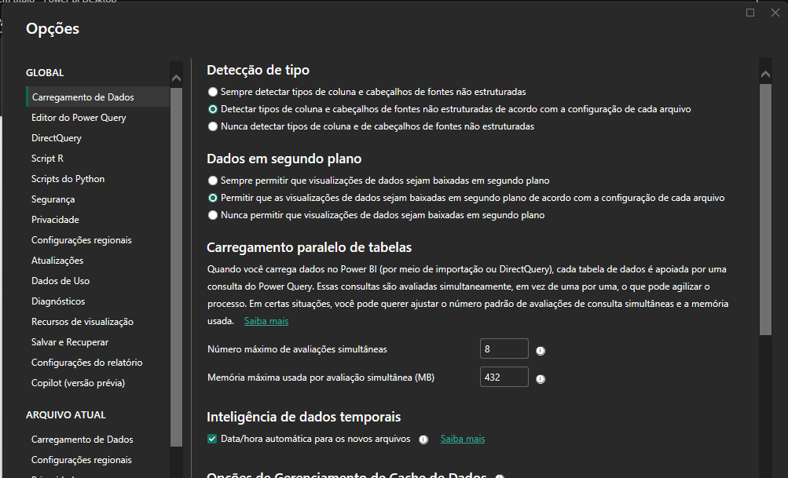
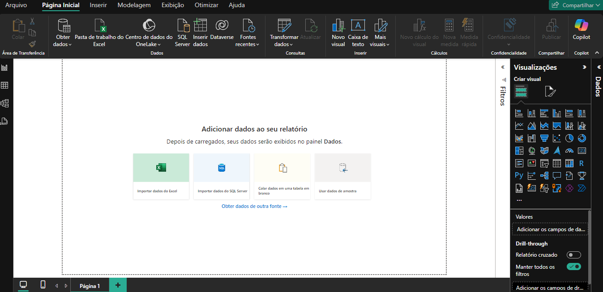

O Power BI desktop recebeu uma grande atualização, onde o Modo Escuro ou *Dark Mode* , está disponível.

Conforme as imagens pode-se perceber que o Power BI desktop ficou bem mais agradável para trabalhar em
ambientes escuros.

Mas e ai o que vocês acharam dessas novidades?

Mais informações consulte a documentação oficial

[Documentação](https://learn.microsoft.com/pt-br/power-bi/)cle