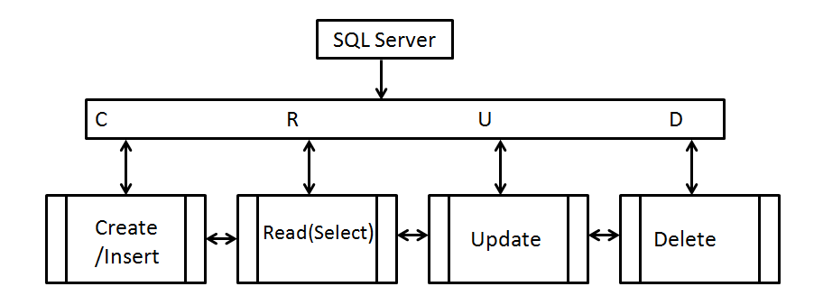

Oi pessoal tudo bom? Nessa postagem iremos falar sobre os comandos básicos de T-SQL.
Iremos iniciar uma série explicando os principais comandos usudos na T-SQL.
Os tópicos serão separados abaixo, cada uma em postagens diferentes, para melhor organização.
<!--more-->
[Select]( "Select")  
[Update]( "Update")  
[Insert]( "Insert")  
[Delete]( "Delete")  

